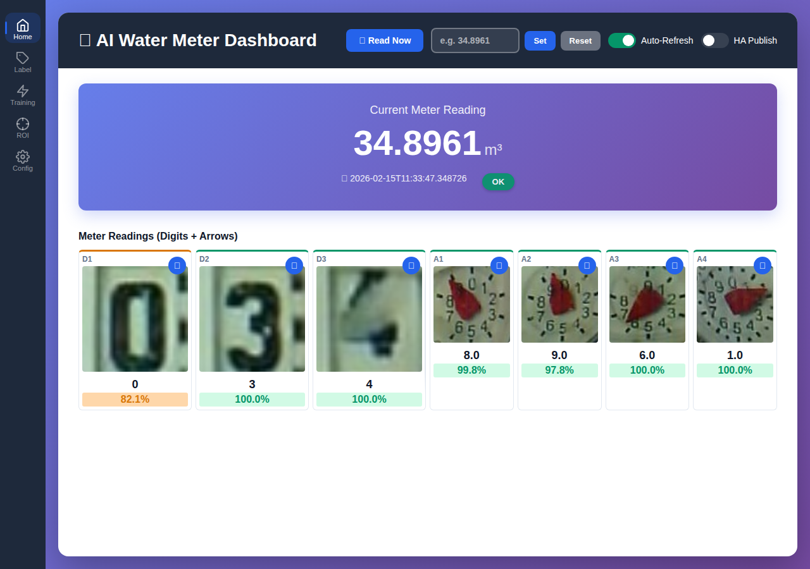

# AI Water Meter

[](LICENSE)

AI-powered water meter reader with live dashboard, built-in model training, and Home Assistant integration. Uses OpenVINO for fast inference on CPU/GPU.



> [!WARNING]
> **AI-assisted hobby project — not production software.**
>
> This application was written ("vibe-coded") almost entirely by AI (Claude). The author reviewed outputs and tested against their own hardware setup — that is the full extent of any quality assurance. There have been no security audits, no penetration tests, no human code reviews, no dependency audits, and no benchmarks. It is provided "AS IS", without warranty of any kind, as stated in the [LICENSE](LICENSE) file.
>
> **What's at stake:** AI Water Meter stores and transmits MQTT broker credentials, camera URLs with authentication parameters, and Home Assistant integration tokens. The web UI has no authentication layer. Dependencies have not been vetted for supply-chain vulnerabilities.
>
> **Do NOT expose this application to the public internet.** Do NOT run it in a shared or untrusted network environment without a thorough independent security review. Anyone deploying this software assumes full responsibility for its operation.
>
> If it breaks, misreads your meter, or leaks your credentials, that is on you. Use entirely at your own risk.

## Features

- **AI-Powered Reading**: Digit classification and analog arrow regression using OpenVINO inference; supports CPU and Intel GPU
- **Live Dashboard**: Real-time meter readings via HTMX polling, confidence color-coding, and per-position image previews
- **Model Training**: Built-in web UI backed by PyTorch and timm; 16 architectures across 3 tiers; training queue with auto-benchmark after each job
- **Smart Validation**: Multi-stage correction engine — spatial consistency checks, cross-arrow validation, temporal plausibility limits
- **MQTT Integration**: Publishes readings and status to Home Assistant via paho-mqtt v2; supports MQTT Discovery (20 entities auto-configured)
- **Benchmarking**: Evaluate models against labeled ground truth datasets; persistent benchmark results per model
- **Interactive Labeling**: Browser-based labeling UI with keyboard shortcuts, mislabel detection, and deduplication
- **ROI Configuration**: 5-step visual wizard for defining digit, analog arrow, and alignment marker regions
- **Leak Detection**: Continuous consumption monitoring using a rate history ring buffer; configurable threshold and window
- **User Confirmation**: Route uncertain readings to Home Assistant for manual verification; configurable timeout and fallback
- **One-Shot CLI Mode**: Single-image inference without running the full service (`python -m watermeter --one-shot`)
- **Synthetic Data Generation**: Augment training datasets with rendered digit and arrow images composited onto photo backgrounds
- **Config Wizard**: Guided first-run setup via `/roi-config?setup=1`
- **Pretrained Model Management**: Download and manage pretrained base models for training

## Quick Start

```bash
git clone https://github.com/zeroflow/watermeter-inference.git
cd watermeter-inference
cp .env.example .env
docker compose up -d
# Visit http://localhost:8001
```

On first run the container will:
- Create a default `config.yaml` in `./config/`
- Install default pre-trained models into `./models/`
- Create data directories for state, readings, and training images

## Configuration

Configuration is managed through the web UI at `/config-editor` (Monaco YAML editor). On first run, the ROI wizard at `/roi-config?setup=1` guides through initial setup.

Changes saved through the UI apply immediately without a container restart (hot config reload).

Key configuration sections:

- **Images** (`images`): image source URL (`src`), capture timeout, fetch delay
- **ROI** (`detection`): digit and arrow regions, alignment markers, rotation — configure via `/roi-config`
- **MQTT** (`mqtt`, `homeassistant`): broker host, port, credentials, HA discovery prefix
- **Plausibility** (`plausibility`): reverse-reading guard, rate limits, consistency checks, leak detection thresholds
- **Training** (`inference`): confidence threshold, inference device, model paths

The full schema is available at `/api/config/schema.json`.

## Key API Endpoints

```
GET  /api/status                          Current reading and system state (full JSON)
POST /api/trigger                         Trigger an immediate reading cycle
POST /api/set-value                       Manually override the meter value
POST /api/training/start                  Enqueue a training job
POST /api/models/{type}/{id}/activate     Set a model as active
GET  /api/training/status                 Current training and benchmark status
GET  /health                              Health check
```

See `/docs` (Swagger UI) or `/redoc` (ReDoc) for the complete API reference (45+ endpoints).

## Development

### Local Environment

The dev environment is a [uv](https://docs.astral.sh/uv/)-managed `.venv` (Python 3.10+):

```bash
./setup.sh
# or manually:
uv venv .venv && uv pip install -r requirements.txt -r requirements-dev.txt
```

### Debug Container

The debug container mounts source code directly and runs on port 8002:

```bash
bash debug.sh --detach           # run in the background
bash debug.sh --purge-models     # wipe the debug models directory first
# Access at http://localhost:8002
```

### Clean-Install Test Container

`debug_clean.sh` tests the first-boot experience in an ephemeral container on port 8003. It has no persistent volumes, serves `tests/fixtures/meter_snapshot.jpg` through an nginx sidecar as the image source, and removes its containers and network on exit:

```bash
bash debug_clean.sh              # foreground; cleans up on exit
bash debug_clean.sh --detach     # background; stop manually (see script output)
```

### Tests

```bash
# Unit tests (no running container required)
.venv/bin/python -m pytest tests/unit/

# Integration tests (requires running container)
.venv/bin/python -m pytest tests/integration/ --base-url=http://localhost:8002
```

The test suite includes 45 unit test files, 8 integration test files, 2 regression test files, and 1 export test file.

### Linting

```bash
uvx ruff check watermeter/
uvx black watermeter/
```

### One-Shot Mode

Run a single inference pass without starting the full service. The image is fetched from `images.src` in the given config file:

```bash
python -m watermeter --one-shot --config config.yaml
```

Exit code 0 on success, 1 on any failure. Prints the computed meter reading to stdout.

## Architecture

- **Backend**: FastAPI with async support and lifespan-managed subsystems
- **Inference**: OpenVINO Runtime (CPU/Intel GPU), hot-reloadable without service restart
- **Training**: PyTorch + timm pretrained models; exported to OpenVINO IR format
- **Frontend**: HTMX + vanilla JavaScript, Jinja2 templates
- **Storage**: File-based — JSON state, YAML config (comment-preserving via ruamel.yaml), trained model directories
- **Messaging**: MQTT via paho-mqtt v2 for Home Assistant integration and external triggers
- **Deployment**: Docker Compose

### Directory Structure

```
watermeter/
├── app.py                    # FastAPI application factory
├── watermeter_service.py     # Core service: reading pipeline, inference
├── inference.py              # OpenVINO inference engine (classification + regression)
├── training_manager.py       # Training job orchestration + benchmark
├── training_core.py          # Low-level training primitives
├── model_manager.py          # Model metadata and lifecycle
├── config_utils.py           # YAML config read/write (ruamel.yaml)
├── persistence.py            # State persistence (JSON)
├── correction.py             # Value correction engine
├── plausibility.py           # Temporal plausibility checks
├── confirmation.py           # HA user confirmation flow
├── mqtt_publisher.py         # MQTT publishing + HA auto-discovery
├── image_pipeline.py         # Image preprocessing pipeline
├── rate_tracker.py           # Flow rate tracking
├── leak_detector.py          # Leak detection logic
├── meter_state.py            # Meter state dataclass
├── scheduling.py             # Cyclic trigger scheduling
├── position_utils.py         # ROI position geometry
├── low_confidence_capture.py # Auto-save uncertain readings
├── synthetic_generator.py    # Synthetic training data generation
├── oneshot.py                # One-shot CLI inference mode
├── photo_master.py           # Camera image acquisition
├── image_hash.py             # Perceptual hashing for dedup
├── routes/                   # FastAPI route modules
│   ├── config.py             # Config CRUD
│   ├── label.py              # Labeling endpoints
│   ├── models.py             # Model management
│   ├── mqtt.py               # MQTT config
│   ├── pages.py              # HTML page routes
│   ├── roi.py                # ROI configuration
│   ├── service.py            # Service control
│   ├── synthetic.py          # Synthetic data endpoints
│   └── training.py           # Training control
├── templates/                # Jinja2 HTML templates
│   ├── dashboard.html
│   ├── training.html
│   ├── label.html
│   ├── roi_config.html
│   ├── config_editor.html
│   └── ...
└── static/                   # CSS, JavaScript
    ├── style.css
    ├── training.js
    ├── roi-config.js
    └── ...
scripts/
├── fetch_upstream_data.sh    # Download upstream training data
├── tune_synthetic.py         # Synthetic generation tuning
└── backfill_training_samples.py
tests/
├── unit/                     # 45 test files
├── integration/              # 8 test files (needs running container)
├── regression/               # 2 test files
└── export/                   # 1 test file
```

## Docker Volumes

| Host path | Container path | Purpose |
|-----------|---------------|---------|
| `./config` | `/config` | Configuration files (`config.yaml` — auto-created on first run) |
| `./data` | `/data` | Persistent state (`state.json`, readings history) |
| `./models` | `/app/models` | Trained model binaries and metadata |
| `./training/digits` | `/training/digits` | Digit training data (`input/`, `ground_truth/`) |
| `./training/arrows` | `/training/arrows` | Arrow training data (`input/`, `ground_truth/`) |
| `hf_cache` (named) | `/app/.cache/huggingface` | Hugging Face pretrained weight cache |

## Optional: Intel GPU Acceleration

To enable GPU inference:

1. Check the GPU device exists: `ls -l /dev/dri/renderD128`
2. Get the render group ID: `stat -c "%g" /dev/dri/renderD128`
3. Uncomment `devices` and `group_add` sections in `docker-compose.yml`
4. Update the group ID to match your system
5. Restart the container: `docker compose up -d`

Alternatively, use `docker-compose.gpu.yml` which pre-configures the GPU device.

## Optional: Local MQTT Broker

If you do not have an existing MQTT broker, uncomment the `mosquitto` service block in `docker-compose.yml` to run Eclipse Mosquitto alongside the watermeter service.

## Utility Scripts

| Script | Purpose |
|--------|---------|
| `debug.sh` | Launch the debug container on port 8002 with source volume mounts (`--detach`, `--purge-models`) |
| `debug_clean.sh` | Ephemeral first-boot test container on port 8003 with an nginx stub image source; no volumes, cleaned up on exit |
| `setup.sh` | Create `.venv` and install `requirements.txt` + `requirements-dev.txt` via `uv` |
| `scripts/fetch_upstream_data.sh` | Download upstream training data from jomjol/AI-on-the-edge-device (see `DATA_PROVENANCE.md`) |

## Data Provenance

Shipped model weights and bundled training samples are licensed under AGPL-3.0. Upstream training data from the [jomjol/AI-on-the-edge-device](https://github.com/jomjol/AI-on-the-edge-device) project must be fetched separately using `scripts/fetch_upstream_data.sh`.

See `DATA_PROVENANCE.md` for full details on dataset origins, licenses, and attribution.

## TODO

Known documentation gaps:

- [ ] Detailed leak detection configuration guide
- [ ] User confirmation flow walkthrough
- [ ] Correction engine algorithm description
- [ ] Complete API endpoint documentation (see `/docs` for now)

## License

This project is licensed under the [GNU Affero General Public License v3.0](LICENSE).

## Acknowledgments

Inspired by [jomjol/AI-on-the-edge-device](https://github.com/jomjol/AI-on-the-edge-device) — analog water/gas meter reading with ESP32-CAM. This project reimplements the core concept with modern ML tools and a web-based training workflow.
